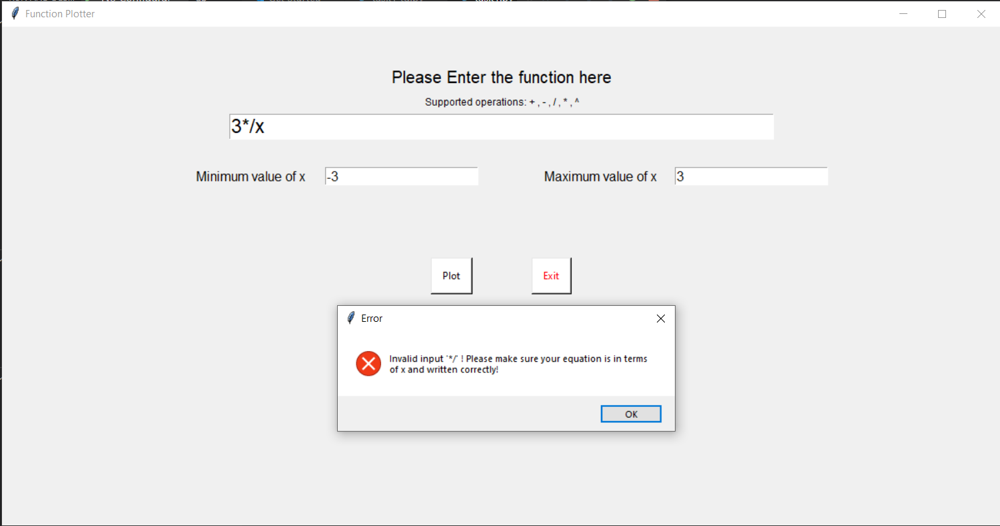
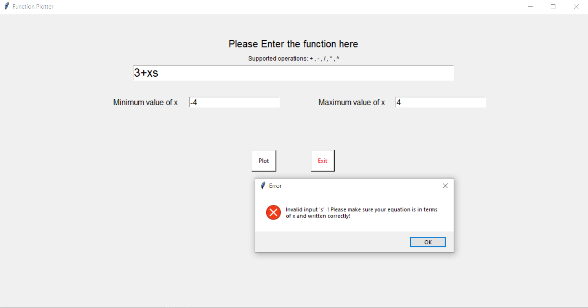
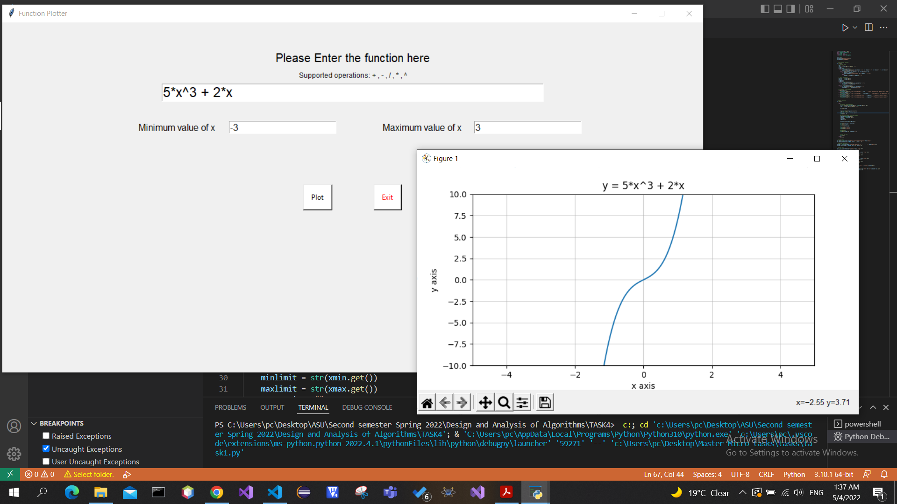
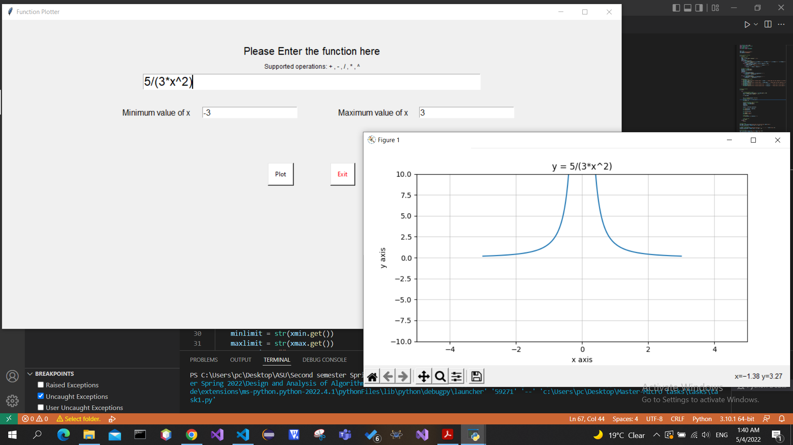

# Function-Plotter
A GUI program that plots arbitrary user-entered function and detects input errors if any of them exists.

# Supported operations
* Addition: +
* Subtration: -
* Division: /
* Multiplication: *
* Power: ^

# Input
* An arbitrary function in terms of x
* Minumum and Maximum values of x

# Output
* A plot for the entered function

# Libraries used
* Matplotlib
* NumPy
* Tkinter

# Snapshots
* Error checking examples:

  
  

* Normal Working examples:

  
  

